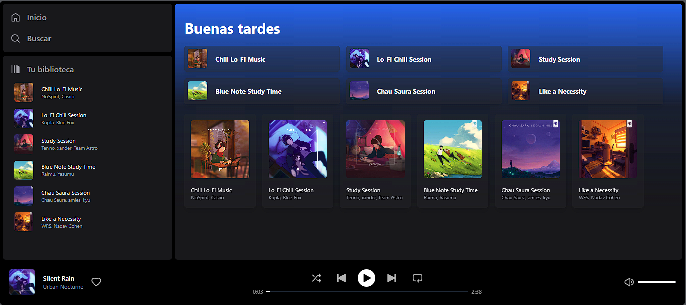

# Astrofy Music Player

  
  

    Astrofy es un clon de Spotify, pero con una biblioteca musical que destaca por su contenido libre de regalías y derechos. Su arquitectura se basa en una combinación tecnológica sólida: fusiona los elementos de Astro, React (JSX & TSX) y Svelte para garantizar una experiencia integral. Para su diseño, hace uso de TailwindCSS, mientras que para la gestión del estado, recurre a Zustand, una herramienta versátil que se muestra completamente independiente y compatible con los tres frameworks empleados. La integración de Zustand asegura la persistencia del estado a lo largo de todos los componentes, lo que potencia la coherencia y la compatibilidad del sistema en su conjunto.
  

